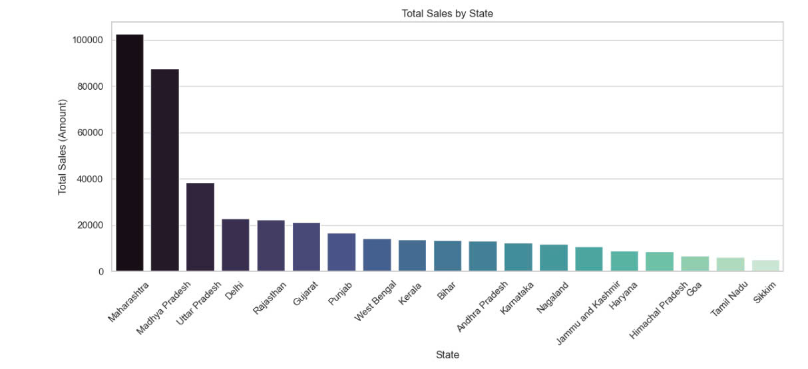

1. Explanation
The bar chart shows the company's revenue by state. Each bar represents the total revenue from all orders originating from
a specific state. The higher the bar, the greater the revenue for that state. The data is aggregated from the "Amount" 
column in the Details.csv file and combined with the "State" column from the Orders.csv file to calculate the total 
revenue for each geographic region.

2. Significance
Importance of the chart: This chart helps the company clearly identify the geographic regions contributing the most to 
total revenue, allowing them to adjust business strategies accordingly for each area. For example, if certain states 
generate higher revenue, the company can consider increasing marketing efforts or expanding distribution in those areas.
Additionally, states with lower revenue can be carefully evaluated to determine if there are any supply chain or 
marketing issues that need adjustment.

3. Pattern
Trends: A common pattern in geographic charts is the clear differentiation between economically developed states and 
less developed ones. States like Delhi or Maharashtra (Mumbai) tend to have higher revenues due to dense populations 
and greater purchasing power.
Anomalies: States with significantly higher revenue (outliers) compared to others may indicate strong sales performance, high product demand, or effective marketing campaigns.

4. Importance
This chart is crucial for management and leadership teams as it helps them recognize key markets, 
prioritize focus on high-revenue areas, and reevaluate strategies for weaker regions.
Additionally, the chart can help leadership make decisions on financial and personnel resource allocation 
across different geographic areas to optimize profitability for the company.

