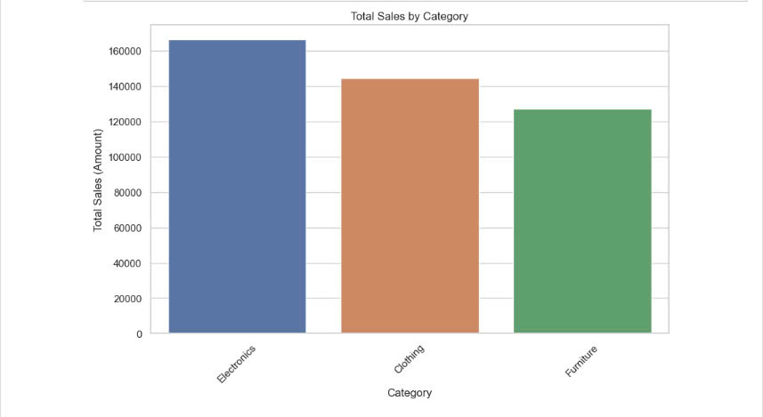

Total Sales by Category (Bar Chart):

- Explanation: This chart shows the total sales (amount) for each product category. Electronics is the highest-performing category, generating the most revenue, followed by Furniture and Clothing.
- Pattern: The sales distribution is uneven, with Electronics far outpacing other categories.
- Importance: This chart helps managers understand which product categories are driving the most sales. A manager can allocate more resources, such as inventory and marketing, to Electronics to maximize profitability. For categories like Clothing, which perform lower, they may need to investigate customer demand or adjust the product mix to improve sales.

