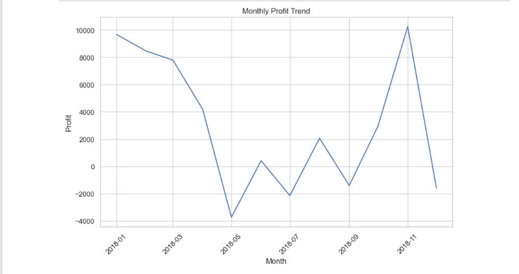

Monthly Profit Trend (Line Chart):

- Explanation: This line chart illustrates how total profit fluctuates on a monthly basis. There may be spikes in profit during specific months,
- likely due to seasonal shopping patterns or promotions.
- Significance: Monitoring profit trends over time helps in understanding seasonality and business cycles. The manager can plan sales campaigns,
- discounts, or promotional events during high-profit months to maximize returns, or address the causes of low-profit months.

- 
