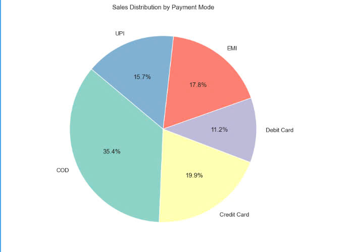

Sales Distribution by Payment Mode (Pie Chart):

Explanation: This pie chart displays the proportion of total sales for each payment mode. The most used payment mode appears to be COD (Cash on Delivery), 
followed by EMI and Credit Card.
Significance: Understanding customer payment preferences allows businesses to optimize payment options. If a large percentage of customers prefer COD, 
the manager might focus on enhancing COD services or offering additional incentives for electronic payment methods like EMI or Credit Card to encourage their usage.

