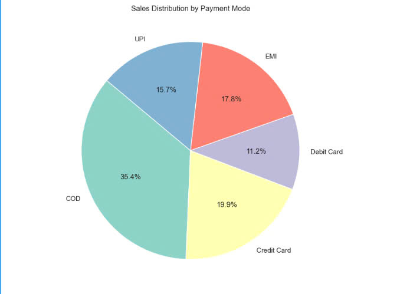

# Minipresentation
# Group 1 
1. Introduction
The data consists of two CSV files: Orders.csv and Details.csv.

Orders.csv contains basic information about customer orders, including order ID, order date, customer name, and location details (state and city).

Details.csv includes more detailed data related to each order, such as order ID, amount, profit, quantity, product category and sub-category, and payment method.

These data sets appear to track sales or order records, possibly from a retail or e-commerce platform, detailing the financial performance (amount and profit) of different product categories, along with the payment methods used for each transaction.

2. Detailed Information
   
- Orders.csv:
+ Order ID: Unique identifier for each order.
+ Order Date: The date the order was placed.
+ Customer Name: The name of the customer who placed the order.
+ State: The state where the customer resides.
+ City: The city where the customer resides.
  
+ Details.csv:
- Order ID: Links this file to the Orders.csv file.
+ Amount: Total value of the order.
+ Profit: Profit earned from the order.
+ Quantity: Number of items in the order.
+ Category: The product category (e.g., Electronics, Furniture).
+ Sub-Category: A more specific description within the category (e.g., Electronic Games, Chairs).
+ PaymentMode: The mode of payment used for the transaction (e.g., COD, EMI, Credit Card).

3. Data Types:
- In Orders.csv, the "Order Date" column is currently in object (string) format and should be converted 
to a proper date format for any time-based analysis.
# orders_df['Order Date'] = pd.to_datetime(orders_df['Order Date'], format='%d-%m-%Y')

- Outliers in Numeric Data (from Details.csv): Amount: The minimum value of 4 and maximum value of 5729 appear normal, though there is a wide range.
# low_amounts = details_df[details_df['Amount'] < 10]

-Profit: There are negative values in the "Profit" column, which may indicate losses. However, some values seem extreme (e.g., -1981), so these should be checked to determine if they are valid or errors.
# extreme_profits = details_df[details_df['Profit'] < -1000]

4. Charts
- Bar Chart:
+ Explanation: Electronics leads in sales, followed by Furniture and Clothing.
+ Significance: Helps allocate resources and plan inventory.
+ Pattern: Sales are uneven, with Electronics far ahead.
+ Importance: Managers can prioritize top-performing categories and reassess weaker ones.

- Line Chart:
+ Explanation: The line chart shows monthly profit fluctuations, with possible spikes during certain months.
+ Significance: Helps identify seasonality and plan promotions for high-profit months.
+ Pattern: Profit spikes in certain months, indicating seasonality (e.g., holidays).
+ Importance: Allows managers to optimize strategies for profitable months and address low-profit periods.

- Pie Chart:
+ Explanation: The pie chart shows COD as the most used payment method, followed by EMI and Credit Card.
+ Significance: Helps optimize payment options and improve customer experience.
+ Pattern: COD is the dominant payment choice among customers.
+ Importance: Allows managers to enhance COD services or promote electronic payments to reduce costs and improve efficiency.

- Bar Chart:
+ Explanation: The bar chart shows total revenue by state, with higher bars indicating greater revenue.
+ Significance: Helps identify top-performing states for adjusting business strategies and marketing efforts.
+ Pattern: Developed states like Delhi and Maharashtra generate more revenue due to higher purchasing power.
+ Importance: Enables leadership to focus on key markets and improve strategies in weaker regions for better profitability.
